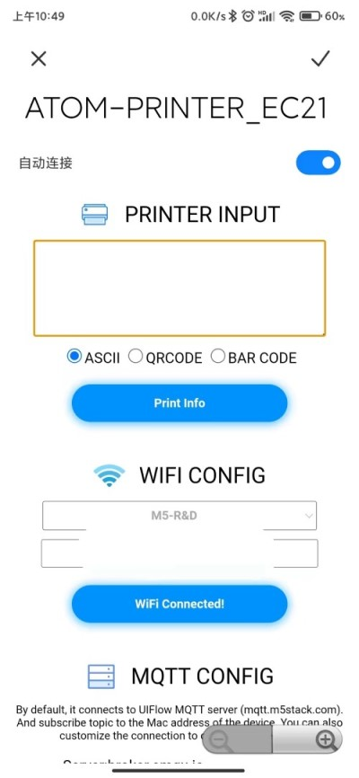
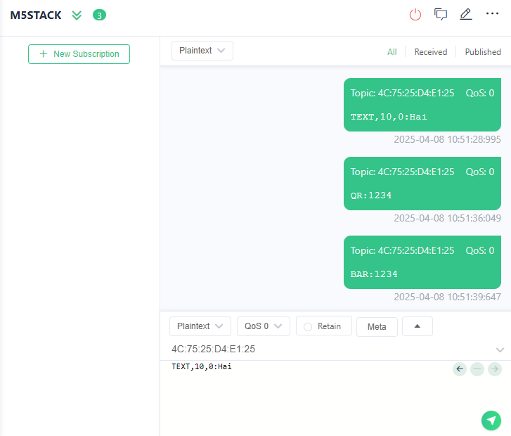

# M5Stack ATOM PRINTER

## Overview

Contains M5Stack **ATOM PRINTER** firmware;


## How to use?


- 1. connect to AP `ATOM_PRINTER-xxxx`
- 2. Configure WIFI and MQTT in the pop-up window (or visit 192.168.4.1)
- 3. Configure WiFi connection first. 
- 4. Configure mqtt server or use the default server(mqtt.m5stack.com)




- 5. print data through mqtt server. publish topic is the device mac address.

```shell
topic: xx:xx:xx:xx:xx:xx

payload:

TEXT,10,0:Hai

BAR:1234

QR:1234

```

## Related Link

[Document & AT Command](https://docs.m5stack.com/en/atom/atom_printer)

