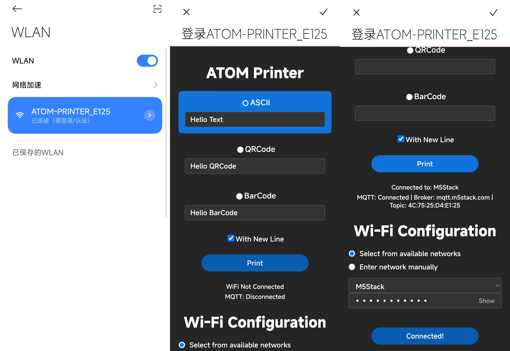

# Atom Printer

## Overview

M5Stack Atom Printer firmware

## How to use?

- 1.connect to AP `ATOM_PRINTER-xxxx`
- 2.Print data via web page (visit 192.168.4.1) 
- 3.Configure Wi-Fi in the web page




- 4.print data through mqtt server. publish topic is the device mac address.

```shell
topic: xx:xx:xx:xx:xx:xx
```

- 5.mqtt payload

```shell
TEXT,10,1:Hai
```

```shell
BAR:1234
```

```shell
QR:1234
```

## Related Link

[Document & AT Command](https://docs.m5stack.com/en/atom/atom_printer)

